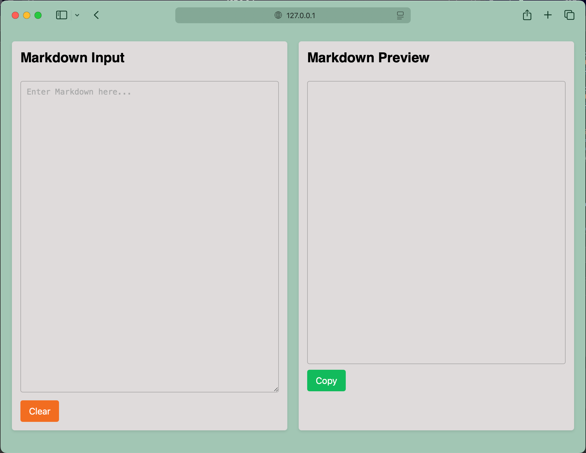
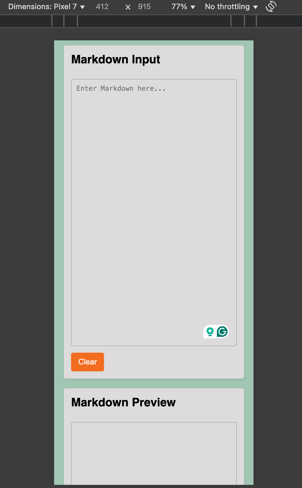

# Markdown Preview 📝

A real-time Markdown previewer that converts Markdown syntax into formatted HTML. Write your Markdown on the left and see the rendered preview on the right instantly!

## 🚀 Features

- **Real-time Preview**: See changes as you type
- **Local Storage**: Your content persists between sessions
- **Copy to Clipboard**: Easy copying of formatted text
- **Clear Function**: Quick reset of both editor and preview
- **Responsive Design**: Works on both desktop and mobile devices

## 🖥️ Demo

[Live Demo](your-deployment-link-here)

## 📸 Screenshots




## 💡 Usage

1. Enter Markdown text in the left panel
2. See the formatted result instantly in the right panel
3. Use the copy button to copy the formatted text
4. Clear button resets both panels

## 🔧 Markdown Support

- Headers (H1-H6)
- Bold and Italic text
- Lists (ordered and unordered)
- Links
- Code blocks
- Blockquotes
- Images

## 🛠️ Technologies Used

- HTML5
- CSS3
- JavaScript
- [Marked.js](https://marked.js.org/) for Markdown parsing
- LocalStorage API for data persistence

## 🌐 Browser Support

- Chrome
- Firefox
- Safari
- Edge

## 💻 Local Development

1. Clone the repository:
```bash
git clone https://github.com/yourusername/markdown-preview.git
```

2. Navigate to project directory:
```bash
cd markdown-preview
```

3. Open `index.html` in your browser

## 🤝 Contributing

Contributions, issues, and feature requests are welcome! 🙂

## 📝 License

This project is [MIT](LICENSE) licensed.

---
[Suman Sarkar](https://x.com/suuumans)